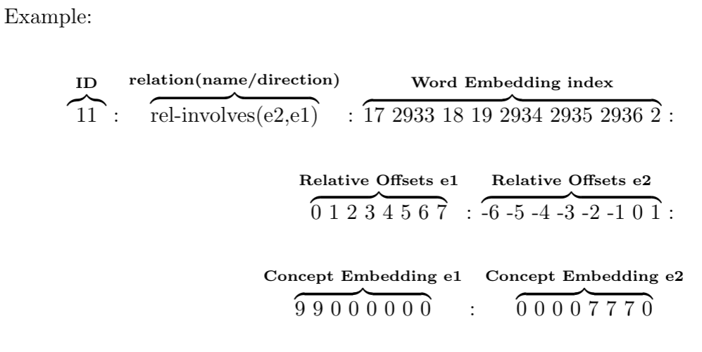

# Data:
## Formats:
Different types and combinations of data formats are used to train the mEx models for each task: 
You could find dummy data for each Format under **./mEx_tools/Data/**
---
### BRAT Format:
The [BRAT](https://brat.nlplab.org/examples.) standoff format is used to annotate & visualize the clinical data.
Each text file **.txt** has an following brat file **.ann** which includes various tags and information about named-entities and relations.  
Example Data: **./Data/fc_brat_data/**
---
### CoNLL-U Format:
The [CoNLL-U](https://universaldependencies.org/format.html) format is used to train the NER model.  
Example Data: **./DataPrep/Brat2Conll/Clean_Conll_Data_For_NER_Train/**
---
### Inside–outside–beginning (tagging) Format:
The [IOB](https://en.wikipedia.org/wiki/Inside%E2%80%93outside%E2%80%93beginning_(tagging)) format is used in combination with the CoNLL-U format which embeds the Span of entites along tokens.  
Example Data: **./DataPrep/Brat2Conll/Clean_Conll_Data_For_NER_Train/**
---
### RelVec Format:
The RelVec format is converted from the BRAT format and embeds different types of information and embeddings.
Example Data: **./DataPrep/Brat2Vec/outputs/1_fake_clinical_data_vec_format/all_data.txt**
* **ID**: is the identifyng number for a given relation
* **relation(name/direction):**: Shows  the  name  of  the  relation  and  the  direction between the two named-entities (e1,e2) e1 to e2, (e2,e1) e2 to e1
* **Word-Embedding-index:**: For each token exists a number which points to the embedding of the token.
* **Relative-Offsets:**: Embeds  the  position  of  each  named  entity  indicated  bya 0, tokens before the target token are indicated with decreasing numbers, tokens after the target token are indicated with increasing numbers.
* **Concept-Embeddings:**: Embeds  the  type  of  the  target  named  entity  with a number that is mapped to the NE type, all other non-target tokens are embedded with 0.
---

