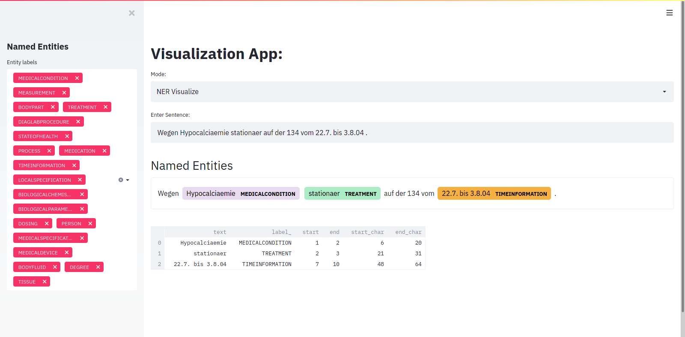
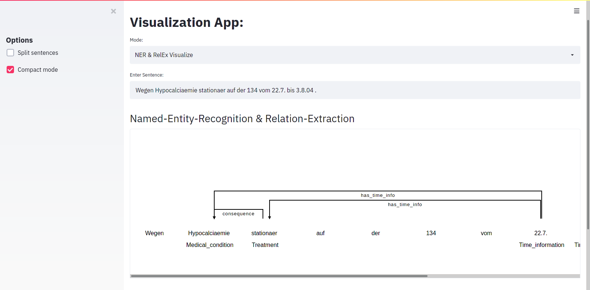

# mEx: NER & RelEx Manual
## mEx Models Overview:
| Task | Language | Dataset | Score | Model Name|
| -------------------------------  | ---  | ----------- | ---------------- | ------------- |
| Named Entity Recognition |German | German Nephrology Corpus (Charite)   |  **83.25** (F1)  | [*named_entity_recognition_mex_model(custom_flair_embeddings).pt*] (https://cloud.dfki.de/owncloud/index.php/s/WWbnqJ6N8gQQWMD)|
| Relation Extraction |German | German Nephrology Corpus (Charite)   |  **84.0** (F1)  | [*relation_extraction_mex_model(Custom_Word_Concept_Relative_Embeddings).pt*] (https://cloud.dfki.de/owncloud/index.php/s/zDH7FHNbXQXkcLx)|
| Part-of-Speech Tagging |German| German Nephrology Corpus (Charite)  | **98.57** (Acc.) | [*part_of_speech_tagger_mex_model(default_word_flair_embeddings).pt*] (https://cloud.dfki.de/owncloud/index.php/s/e7G9deea7eRksCY)|
---
## Quick Start:
### Requirements and Installation:
The project is based on [Flair 0.6.1](https://github.com/flairNLP/flair/releases/tag/v0.6.1) and 
[Flair 0.2.0](https://github.com/amrayach/flair) which have been tweaked to enable Relation Extraction, for that reason we need
two separate Virtual Environments to run the examples.
* Python 3.6
* mEx Models, optional:Default/Fine-tuned Word Embeddings
* mEx Models must be available under **./mEx_nlp/Resources/**
* NER, RelEx Virtual Envs
### Virtual Environments:
#### Download & Install Miniconda (or other environment manager):
Get the miniconda installer for your os under [conda](https://docs.conda.io/en/latest/miniconda.html)
#### Create NER VirtualEnv:
```
conda create -n NER python=3.6
pip install requierments_ner.txt

# Activate Env
conda activate NER
```
#### Create RelEx VirtualEnv:
 ```
conda create -n RelEx python=3.6
pip install requierments_relex.txt

# Activate Env
conda activate RelEx
```
## NER Prediction Server:
For all the following examples, the NER Prediction Server must be on.
make sure the port is available and same in **app.py** and **named_entity_recognition.py**
 ```
conda activate NER
cd mEx_nlp/NamedEntityRecognition/
python app.py
 ```
---
## Tutorials:
* [Tutorial 1: Data](Documentation/Data.md)
* [Tutorial 2: Data-Preparation](Documentation/Data-Preparation.md)
* [Tutorial 3: Pipeline](Documentation/Pipeline.md)
* [Tutorial 4: NER-Train](Documentation/NER-Train.md)
* [Tutorial 5: RelEx-Train](Documentation/RelEx-Train.md)
---
## Named-Entity-Recognition Jupyter Notebook Manual:
This is a quick tutorial on how to use the NER model.
 ```
conda activate NER
jupyter notebook NER_Manual.ipynb
 ```
---
## Relation-Extraction Jupyter Notebook Manual:
This is a quick tutorial on how to use the RelEx model.
 ```
conda activate RelEx
jupyter notebook REL_Manual.ipynb
 ```
---
## Model Results Virtualization:
This part was built using [Streamlit](https://www.streamlit.io/), [Spacy](https://spacy.io/) and [spacy-streamlit](https://github.com/explosion/spacy-streamlit).
 ```
conda activate RelEx
streamlit run visualize_model_predictions.py
 ```
---

---

---
## Note:
This project is still under development so await updates in the future.